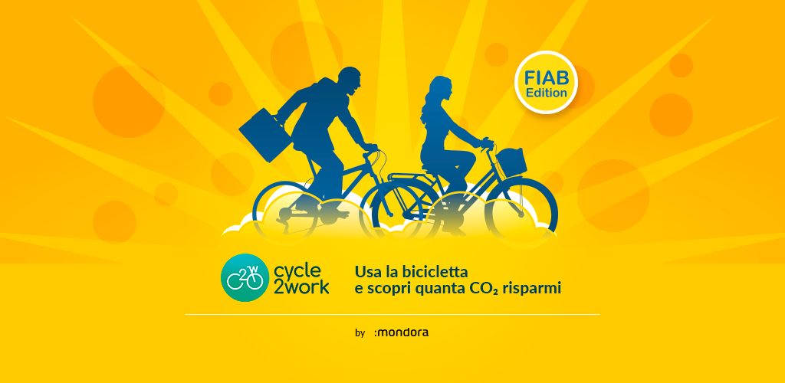

# Cycle2Work

This app aims to encourage its users to bike more often instead of driving a car to go to work. This app will inform its users of the positive impact of biking on reducing CO2 emissions compared to driving a car. In fact, any time you ride your bike you will see the amount of CO2 emission reduction that corresponds to the distance you traveled by bike instead of using your car.

## Parts

-   This app have two main part:
    -   [Client app](client_app/README.md) that contains mobile apps (Android and iOS) and Admin pannels.
    -   [Server app](server_app/README.md) that contains all services for backe-end.

## Technology

-   [Client app](client_app/README.md) used [Flutter framework](https://flutter.dev/). Flutter is an open source framework by Google for building beautiful, natively compiled, multi-platform applications from a single codebase.

-   [Server app](server_app/README.md) used [Firebase services](https://firebase.google.com/). Firebase is an app development platform that helps you build and grow apps and games users love. Backed by Google and trusted by millions of businesses around the world.
